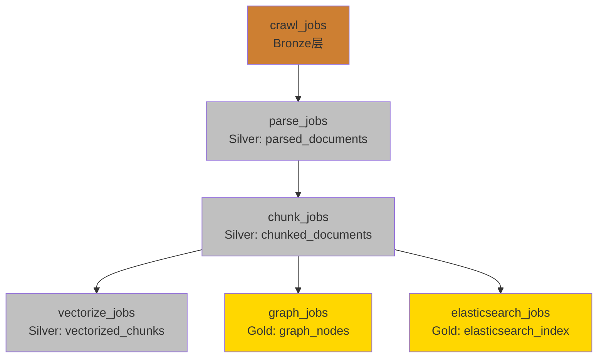

# 数据血缘文档

**更新日期**: 2026-02-04  
**版本**: V2.0

---

## 📊 数据血缘概览

FinNet 项目使用 **Dagster Software-Defined Assets (@asset)** 建立完整的数据血缘追踪体系，实现从原始数据（Bronze层）到应用数据（Gold层）的完整数据流转追踪。

### 实现方式

**V2.0 采用 Software-Defined Assets (选项A)**：
- 使用 `@asset` 装饰器定义数据资产
- 通过 `deps` 参数声明资产依赖关系
- Dagster UI 自动生成可交互的 Lineage 图
- 资产文件位置: `src/processing/compute/dagster/assets/lineage_assets.py`

## 🔄 数据流依赖图



**关键依赖关系说明**:

- `parse_jobs` 依赖 `crawl_jobs` (bronze → silver/parsed_documents)
- `chunk_jobs` 依赖 `parse_jobs` (silver/parsed_documents → silver/chunked_documents)
- `vectorize_jobs` 依赖 `chunk_jobs` (silver/chunked_documents → silver/vectorized_chunks)
- `graph_jobs` **直接依赖** `chunk_jobs` (silver/chunked_documents → gold/graph_nodes)
- `elasticsearch_jobs` **直接依赖** `chunk_jobs` (silver/chunked_documents → gold/elasticsearch_index)

**注意**: `vectorize_jobs`、`graph_jobs` 和 `elasticsearch_jobs` 是**并行**的，都依赖 `chunk_jobs`，不互相依赖。

---

## 📋 资产命名规范

### 统一格式

```
[layer, category, market?, doc_type?, stock_code?, year?, quarter?]
```

### 层级说明

- **`bronze`**: 原始数据层（爬虫）
- **`silver`**: 加工数据层（解析、分块、向量化）
- **`gold`**: 应用数据层（图、索引）
- **`quality_metrics`**: 质量指标

### 资产key示例

#### Bronze层（原始数据）

```python
# 年报
["bronze", "a_share", "annual_report", "2023", "Q4"]

# 季报
["bronze", "a_share", "quarterly_report", "2023", "Q3"]

# IPO招股说明书
["bronze", "a_share", "ipo_prospectus"]
```

#### Silver层（加工数据）

```python
# 解析后的文档
["silver", "parsed_documents", "a_share", "annual_report", "000001", "2023", "Q4"]

# 分块后的文档
["silver", "chunked_documents", "a_share", "annual_report", "000001"]

# 向量化的分块
["silver", "vectorized_chunks", "a_share", "annual_report", "000001"]
```

#### Gold层（应用数据）

```python
# 图节点
["gold", "graph_nodes", "a_share", "annual_report", "000001"]

# Elasticsearch索引
["gold", "elasticsearch_index", "a_share", "annual_report", "000001"]
```

#### 质量指标

```python
["quality_metrics", "crawl_validation"]
["quality_metrics", "parse_validation"]
["quality_metrics", "chunk_validation"]
["quality_metrics", "vectorize_validation"]
["quality_metrics", "graph_validation"]
["quality_metrics", "elasticsearch_validation"]
```

---

## 🔗 依赖关系实现

### Software-Defined Assets (@asset)

V2.0 使用 `@asset` 装饰器通过 `deps` 参数声明显式依赖关系：

```python
from dagster import asset, AssetKey

@asset(
    key_prefix=["silver"],
    deps=[AssetKey(["bronze", "bronze_documents"])],
    group_name="data_processing",
    description="解析后的文档（Silver层）",
)
def silver_parsed_documents(context):
    """Silver 层资产，依赖 bronze_documents"""
    ...
```

### 资产定义文件

所有资产定义位于 `src/processing/compute/dagster/assets/lineage_assets.py`：

| 资产名称 | 层级 | 依赖 | 描述 |
|---------|------|------|------|
| `bronze_documents` | Bronze | - | 原始文档 |
| `silver_parsed_documents` | Silver | bronze_documents | 解析后文档 |
| `silver_chunked_documents` | Silver | silver_parsed_documents | 分块后文档 |
| `silver_vectorized_chunks` | Silver | silver_chunked_documents | 向量化分块 |
| `gold_graph_nodes` | Gold | silver_chunked_documents | Neo4j 图节点 |
| `gold_elasticsearch_index` | Gold | silver_chunked_documents | ES 索引 |
| `pipeline_quality_metrics` | Quality | 所有资产 | 质量指标汇总 |

### Dagster UI 自动可视化

Dagster 会自动根据 `@asset` 的 `deps` 参数在 Assets 页面生成可交互的 Lineage 图，无需手动维护。

---

## 📍 各作业的资产记录

### 1. crawl_jobs.py

**文件**: `src/processing/compute/dagster/jobs/crawl_jobs.py`

**资产记录位置**:
- `crawl_a_share_reports_op`: 为每个成功爬取的文档记录 AssetMaterialization
- `validate_crawl_results_op`: 记录爬取质量指标

**资产key格式**:
```python
["bronze", "a_share", doc_type_str, str(year), f"Q{quarter}"]
["quality_metrics", "crawl_validation"]
```

**元数据包含**:
- stock_code, company_name
- minio_path, file_size, file_hash
- document_id

---

### 2. parse_jobs.py

**文件**: `src/processing/compute/dagster/jobs/parse_jobs.py`

**资产记录位置**:
- `parse_documents_op`: 为每个成功解析的文档记录 AssetMaterialization
- `validate_parse_results_op`: 记录解析质量指标

**资产key格式**:
```python
["silver", "parsed_documents", market, doc_type, stock_code, str(year), f"Q{quarter}"]
["quality_metrics", "parse_validation"]
```

**元数据包含**:
- document_id, stock_code, company_name
- text_length, page_count
- silver_path (MinIO路径)
- parent_asset_key (指向bronze层)

---

### 3. chunk_jobs.py

**文件**: `src/processing/compute/dagster/jobs/chunk_jobs.py`

**资产记录位置**:
- `chunk_documents_op`: 为每个成功分块的文档记录 AssetMaterialization
- `validate_chunk_results_op`: 记录分块质量指标

**资产key格式**:
```python
["silver", "chunked_documents", market, doc_type, stock_code]
["quality_metrics", "chunk_validation"]
```

**元数据包含**:
- document_id, chunks_count, avg_chunk_size
- structure_path, chunks_path
- chunked_at
- parent_asset_key (指向parsed_documents)

---

### 4. vectorize_jobs.py

**文件**: `src/processing/compute/dagster/jobs/vectorize_jobs.py`

**资产记录位置**:
- `vectorize_chunks_op`: 为每个成功向量化的分块记录 AssetMaterialization（批次回调）
- `validate_vectorize_results_op`: 记录向量化质量指标

**资产key格式**:
```python
["silver", "vectorized_chunks", market, doc_type, stock_code]
["quality_metrics", "vectorize_validation"]
```

**元数据包含**:
- chunk_id, document_id
- stock_code, company_name
- chunk_index, batch信息
- vectorized_at
- parent_asset_key (指向chunked_documents)

---

### 5. graph_jobs.py

**文件**: `src/processing/compute/dagster/jobs/graph_jobs.py`

**资产记录位置**:
- `build_graph_op`: 为每个成功建图的文档记录 AssetMaterialization
- `validate_graph_op`: 记录图构建质量指标

**资产key格式**:
```python
["gold", "graph_nodes", market, doc_type, stock_code]
["quality_metrics", "graph_validation"]
```

**元数据包含**:
- document_id, nodes_count, edges_count
- graph_built_at
- parent_asset_key (指向chunked_documents，**直接依赖chunk_jobs**)

---

### 6. elasticsearch_jobs.py

**文件**: `src/processing/compute/dagster/jobs/elasticsearch_jobs.py`

**资产记录位置**:
- `index_chunks_to_elasticsearch_op`: 为每个成功索引的文档记录 AssetMaterialization
- `validate_elasticsearch_results_op`: 记录索引质量指标

**资产key格式**:
```python
["gold", "elasticsearch_index", market, doc_type, stock_code]
["quality_metrics", "elasticsearch_validation"]
```

**元数据包含**:
- document_id, indexed_chunks_count
- indexed_at
- parent_asset_key (指向chunked_documents，**直接依赖chunk_jobs**)

---

## 🎯 在 Dagster UI 中查看数据血缘

### 1. Assets 页面

1. 打开 Dagster UI
2. 点击左侧导航栏的 **"Assets"** 标签
3. 可以看到所有资产的层次结构：
   - `bronze/` - 原始数据层
   - `silver/` - 加工数据层
   - `gold/` - 应用数据层
   - `quality_metrics/` - 质量指标

### 2. 查看资产详情

1. 点击任意资产
2. 在详情页面可以看到：
   - **Materializations**: 所有物化事件
   - **Lineage**: 数据血缘图（上游和下游）
   - **Metadata**: 元数据信息

### 3. 查看依赖关系

在资产的 **Lineage** 标签页中，可以看到：
- **Upstream**: 上游资产（依赖的数据源）
- **Downstream**: 下游资产（使用此数据的目标）

---

## 📝 使用示例

### 示例1: 追踪一个文档的完整生命周期

假设有一个文档：`000001`（平安银行）的 `2023` 年 `Q4` 年报

1. **Bronze层**: `["bronze", "a_share", "annual_report", "2023", "Q4"]`
   - 由 `crawl_a_share_reports_op` 创建

2. **Silver层 - 解析**: `["silver", "parsed_documents", "a_share", "annual_report", "000001", "2023", "Q4"]`
   - 由 `parse_documents_op` 创建
   - parent_asset_key: `bronze/a_share/annual_report/2023/Q4`

3. **Silver层 - 分块**: `["silver", "chunked_documents", "a_share", "annual_report", "000001"]`
   - 由 `chunk_documents_op` 创建
   - parent_asset_key: `silver/parsed_documents/a_share/annual_report/000001/2023/Q4`

4. **Silver层 - 向量化**: `["silver", "vectorized_chunks", "a_share", "annual_report", "000001"]`
   - 由 `vectorize_chunks_op` 创建
   - parent_asset_key: `silver/chunked_documents/a_share/annual_report/000001`

5. **Gold层 - 图**: `["gold", "graph_nodes", "a_share", "annual_report", "000001"]`
   - 由 `build_graph_op` 创建
   - parent_asset_key: `silver/chunked_documents/a_share/annual_report/000001`

6. **Gold层 - 索引**: `["gold", "elasticsearch_index", "a_share", "annual_report", "000001"]`
   - 由 `index_chunks_to_elasticsearch_op` 创建
   - parent_asset_key: `silver/chunked_documents/a_share/annual_report/000001`

---

## 🔍 查询数据血缘

### 通过 Dagster API

```python
from dagster import DagsterInstance

instance = DagsterInstance.get()

# 查询资产的所有物化事件
asset_key = AssetKey(["silver", "chunked_documents", "a_share", "annual_report", "000001"])
materializations = instance.get_event_records(
    EventRecordsFilter(
        asset_key=asset_key,
        event_type=DagsterEventType.ASSET_MATERIALIZATION
    )
)

# 查看元数据中的 parent_asset_key
for record in materializations:
    metadata = record.event_log_entry.dagster_event.event_specific_data.materialization.metadata
    parent_key = metadata.get("parent_asset_key")
    print(f"Parent asset: {parent_key}")
```

---

## 📚 相关文档

- [DAGSTER_INTEGRATION.md](./DAGSTER_INTEGRATION.md) - Dagster 集成指南
- [ARCHITECTURE.md](./ARCHITECTURE.md) - 项目架构文档
- [plan.md](../plan.md) - 项目总体规划

---

## 🎨 数据血缘可视化

在 Dagster UI 的 Assets 页面，数据血缘会自动可视化为有向图，可以：

1. **查看完整数据流**: 从 Bronze 到 Gold 的完整路径
2. **追踪数据来源**: 点击任意资产，查看其上游依赖
3. **追踪数据去向**: 查看哪些下游资产使用了此数据
4. **查看质量指标**: 质量指标资产关联到具体的数据资产

---

## ⚠️ 注意事项

1. **向后兼容**: 保持现有 AssetMaterialization 的格式不变
2. **性能考虑**: AssetMaterialization 记录不应影响作业性能
3. **错误处理**: 确保 AssetMaterialization 记录失败不影响主流程
4. **命名一致性**: 统一使用相同的资产key格式
5. **元数据完整性**: 确保关键信息都记录在metadata中

---

## 🔄 更新日志

### V2.0 (2026-02-04)

- ✅ **迁移到 Software-Defined Assets**：使用 `@asset` 装饰器定义资产
- ✅ **显式依赖声明**：通过 `deps` 参数建立资产依赖关系
- ✅ **可交互 Lineage 图**：Dagster UI 自动生成可交互的血缘图
- ✅ 新增资产文件：`src/processing/compute/dagster/assets/lineage_assets.py`
- ✅ 更新 Dagster Definitions 以包含 Assets

### V1.0 (2026-01-28)

- ✅ 为所有 Dagster 作业添加 AssetMaterialization 记录
- ✅ 建立完整的数据血缘关系（通过 parent_asset_key）
- ✅ 统一资产命名规范
- ✅ 创建数据血缘文档
