# FinNet 数据库模型 UML 关系图

## ER 关系图

```mermaid
erDiagram
    %% ========================================
    %% 核心文档处理流水线
    %% ========================================

    Document {
        UUID id PK
        String stock_code "股票代码"
        String company_name "公司名称"
        String market "市场"
        String doc_type "文档类型"
        Integer year "年份"
        Integer quarter "季度"
        String minio_object_path UK "MinIO路径"
        BigInteger file_size "文件大小"
        String file_hash "文件哈希"
        String source_url "来源URL"
        String status "状态"
        DateTime created_at "创建时间"
        DateTime crawled_at "爬取时间"
        DateTime parsed_at "解析时间"
        DateTime chunked_at "分块时间"
        DateTime vectorized_at "向量化时间"
        DateTime graphed_at "图谱化时间"
        DateTime publish_date "发布日期"
        Text error_message "错误信息"
        Integer retry_count "重试次数"
    }

    ParseTask {
        UUID id PK
        UUID document_id FK "关联文档"
        String parser_type "解析器类型"
        String parser_version "解析器版本"
        String status "状态"
        String output_path "输出路径"
        Text error_message "错误信息"
        DateTime created_at "创建时间"
        DateTime started_at "开始时间"
        DateTime completed_at "完成时间"
        JSON extra_metadata "元数据"
    }

    ParsedDocument {
        UUID id PK
        UUID document_id FK "关联文档"
        UUID parse_task_id FK "关联解析任务"
        String content_json_path "内容JSON路径"
        String markdown_path "Markdown路径"
        String middle_json_path "Middle JSON路径"
        String model_json_path "Model JSON路径"
        String image_folder_path "图片文件夹路径"
        String structure_json_path "structure.json路径"
        String chunks_json_path "chunks.json路径"
        String content_json_hash "JSON哈希"
        String source_document_hash "源文档哈希"
        String structure_json_hash "structure哈希"
        String chunks_json_hash "chunks哈希"
        Integer text_length "文本长度"
        Integer tables_count "表格数量"
        Integer images_count "图片数量"
        Integer pages_count "页数"
        Integer chunks_count "分块数量"
        String parser_type "解析器类型"
        Float parsing_quality_score "解析质量评分"
        Boolean has_tables "含表格"
        Boolean has_images "含图片"
        String status "状态"
        DateTime parsed_at "解析时间"
        DateTime chunked_at "分块时间"
    }

    Image {
        UUID id PK
        UUID parsed_document_id FK "关联解析文档"
        UUID document_id FK "关联文档"
        Integer image_index "图片序号"
        String filename "文件名"
        String file_path "文件路径"
        Integer page_number "页码"
        JSON bbox "边界框"
        String description "描述"
        Integer width "宽度"
        Integer height "高度"
        BigInteger file_size "文件大小"
        String file_hash "文件哈希"
        DateTime created_at "创建时间"
    }

    ImageAnnotation {
        UUID id PK
        UUID image_id FK "关联图片"
        Integer annotation_version "标注版本"
        String category "分类类别"
        String subcategory "子类别"
        Float confidence "置信度"
        String annotator_type "标注者类型"
        String annotator_id "标注者ID"
        String status "状态"
        Text annotation_text "标注文本"
        JSON tags "标签"
        DateTime created_at "创建时间"
    }

    DocumentChunk {
        UUID id PK
        UUID document_id FK "关联文档"
        Integer chunk_index "分块索引"
        Text chunk_text "分块文本"
        Integer chunk_size "分块大小"
        String title "标题"
        Integer title_level "标题层级"
        Integer heading_index "标题索引"
        UUID parent_chunk_id "父分块ID(自引用)"
        Integer start_line "起始行号"
        Integer end_line "结束行号"
        Boolean is_table "是否表格"
        String status "向量化状态"
        String embedding_model "向量模型"
        DateTime vectorized_at "向量化时间"
        DateTime es_indexed_at "ES索引时间"
        JSON extra_metadata "元数据"
    }

    %% ========================================
    %% 任务管理
    %% ========================================

    CrawlTask {
        UUID id PK
        String task_type "任务类型"
        String stock_code "股票代码"
        String company_name "公司名称"
        String market "市场"
        String doc_type "文档类型"
        Integer year "年份"
        Integer quarter "季度"
        String status "状态"
        Boolean success "是否成功"
        UUID document_id FK "关联文档"
        Text error_message "错误信息"
        DateTime created_at "创建时间"
        DateTime started_at "开始时间"
        DateTime completed_at "完成时间"
        JSON extra_metadata "元数据"
    }

    EmbeddingTask {
        UUID id PK
        UUID document_id FK "关联文档"
        String embedding_model "向量模型"
        String status "状态"
        Integer chunks_count "分块总数"
        Integer completed_chunks "已完成分块"
        Text error_message "错误信息"
        DateTime created_at "创建时间"
        DateTime started_at "开始时间"
        DateTime completed_at "完成时间"
        JSON extra_metadata "元数据"
    }

    %% ========================================
    %% 数据质量管理
    %% ========================================

    ValidationLog {
        UUID id PK
        UUID document_id FK "关联文档"
        String validation_type "验证类型"
        String validation_status "验证结果"
        Text message "消息"
        JSON details "详情"
        DateTime created_at "创建时间"
    }

    QuarantineRecord {
        UUID id PK
        UUID document_id FK "关联文档(可空)"
        String source_type "来源类型"
        String doc_type "文档类型"
        String original_path "原始路径"
        String quarantine_path "隔离路径"
        String failure_stage "失败阶段"
        String failure_reason "失败原因"
        Text failure_details "失败详情"
        String status "状态"
        String handler "处理人"
        Text resolution "处理说明"
        DateTime quarantine_time "隔离时间"
        DateTime resolution_time "处理时间"
        JSON extra_metadata "元数据"
    }

    %% ========================================
    %% 上市公司基础数据
    %% ========================================

    ListedCompany {
        String code PK "股票代码(A股)"
        String name "公司简称"
        String org_id "机构ID"
        String org_name_cn "全称(中文)"
        String org_name_en "全称(英文)"
        Text main_operation_business "主营业务"
        Text operating_scope "经营范围"
        String telephone "电话"
        String email "邮箱"
        String org_website "网站"
        String reg_address_cn "注册地址"
        String legal_representative "法定代表人"
        String provincial_name "省份"
        BigInteger established_date "成立日期"
        BigInteger listed_date "上市日期"
        Float reg_asset "注册资本"
        Integer staff_num "员工人数"
        String industry_code "行业代码"
        String industry "行业名称"
        DateTime created_at "创建时间"
        DateTime updated_at "更新时间"
    }

    HKListedCompany {
        String code PK "股票代码(港股)"
        String name "公司名称"
        String org_name_cn "全称(中文)"
        String org_name_en "全称(英文)"
        Integer org_id "披露易orgId"
        String category "分类"
        String sub_category "次分类"
        Text org_cn_introduction "公司简介"
        String telephone "电话"
        String email "邮箱"
        String org_website "网站"
        String reg_location "注册地"
        String chairman "董事长"
        BigInteger established_date "成立日期"
        BigInteger listed_date "上市日期"
        Integer staff_num "员工人数"
        String security_type "证券类型"
        Boolean is_sh_hk_connect "沪港通"
        Boolean is_sz_hk_connect "深港通"
        String industry "所属行业"
        DateTime created_at "创建时间"
        DateTime updated_at "更新时间"
    }

    %% ========================================
    %% 关系定义
    %% ========================================

    Document ||--o{ ParseTask : "1:N 解析任务"
    Document ||--o{ ParsedDocument : "1:N 解析结果"
    Document ||--o{ DocumentChunk : "1:N 文档分块"
    Document ||--o{ Image : "1:N 图片"
    Document ||--o{ CrawlTask : "1:N 爬取任务"
    Document ||--o{ EmbeddingTask : "1:N 向量化任务"
    Document ||--o{ ValidationLog : "1:N 验证日志"
    Document ||--o| QuarantineRecord : "1:0..N 隔离记录"

    ParseTask ||--o{ ParsedDocument : "1:N 解析产出"

    ParsedDocument ||--o{ Image : "1:N 提取图片"

    Image ||--o{ ImageAnnotation : "1:N 图片标注"

    DocumentChunk ||--o{ DocumentChunk : "自引用:父子层级"
```



## 模型关系说明

### 核心数据流水线（Bronze → Silver → Gold）

```
Document (Bronze层 - 原始文档)
    │
    ├── ParseTask (解析任务管理)
    │       └── ParsedDocument (Silver层 - 解析结果)
    │               └── Image (提取的图片)
    │                       └── ImageAnnotation (图片标注)
    │
    ├── DocumentChunk (文档分块 → Milvus向量/ES全文索引)
    │       └── DocumentChunk (父子层级自引用)
    │
    ├── CrawlTask (爬取任务)
    ├── EmbeddingTask (向量化任务)
    ├── ValidationLog (数据验证)
    └── QuarantineRecord (隔离记录)

ListedCompany (A股上市公司基础数据，表名 hs_listed_companies)
HKListedCompany (港股上市公司基础数据，独立表)
```

### 外键关系汇总

| 子表 | 外键字段 | 父表 | 删除策略 |
|------|----------|------|----------|
| `parse_tasks` | `document_id` | `documents` | CASCADE |
| `parsed_documents` | `document_id` | `documents` | CASCADE |
| `parsed_documents` | `parse_task_id` | `parse_tasks` | CASCADE |
| `images` | `parsed_document_id` | `parsed_documents` | CASCADE |
| `images` | `document_id` | `documents` | CASCADE |
| `image_annotations` | `image_id` | `images` | CASCADE |
| `document_chunks` | `document_id` | `documents` | CASCADE |
| `crawl_tasks` | `document_id` | `documents` | SET NULL |
| `embedding_tasks` | `document_id` | `documents` | CASCADE |
| `validation_logs` | `document_id` | `documents` | CASCADE |
| `quarantine_records` | `document_id` | `documents` | CASCADE |
| `document_chunks` | `parent_chunk_id` | `document_chunks` | *(自引用, 无FK约束)* |
